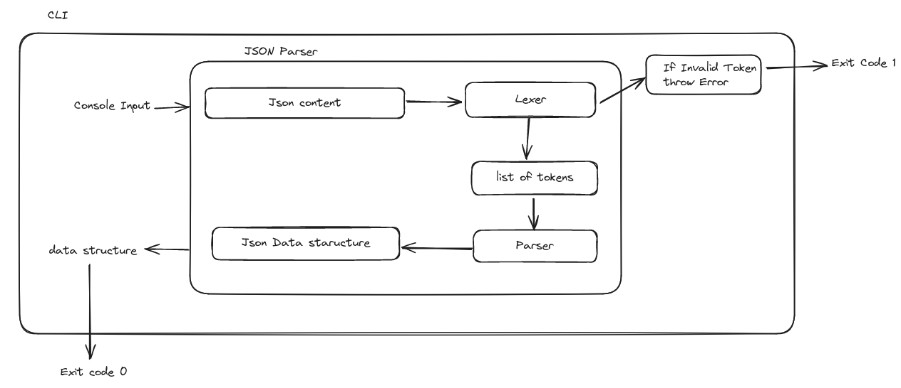

# Custom JSON Parser

This project is a custom JSON parser implemented in Java, following a functional programming approach. The parser uses a two-phase process where the JSON input is first tokenized by a lexer and then parsed into a data structure by the parser.

## Project Structure

- **Lexer**: Converts JSON strings into a list of tokens.
- **Parser**: Processes the list of tokens to build the JSON data structure.

## Architecture



## Installation

To install the project dependencies and build the project, run:

```bash
mvn clean install
```

## Running Unit tests

```bash
mvn test
```
